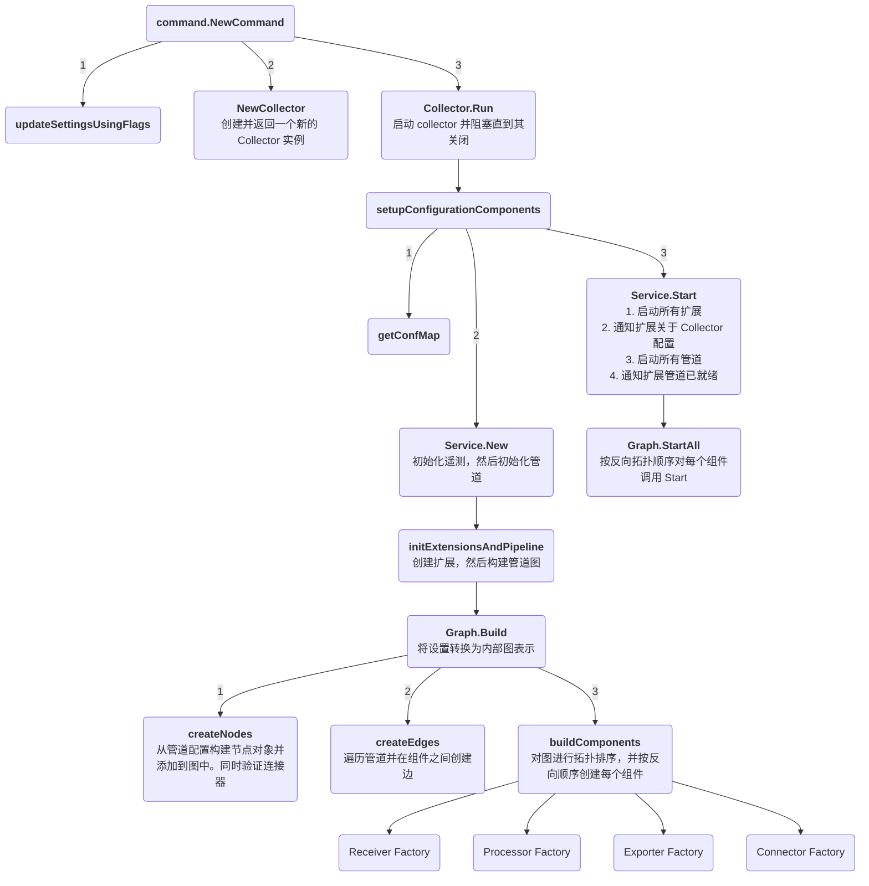

## 内部架构

本文档描述了 OpenTelemetry Collector 的内部架构和启动流程。如果您准备开始为 Collector 代码库做贡献，本文档将对您有所帮助。

关于面向最终用户的架构文档，请参阅 [opentelemetry.io 的架构文档](https://opentelemetry.io/docs/collector/architecture/)。虽然它是面向最终用户的，但如果您试图了解 Collector 代码库，它仍然是一个很好的起点。

### 启动流程图

### 从哪里开始阅读代码

以下是一些有用和/或重要的文件和接口的简要列表，您可能会发现浏览这些文件很有价值。
这些文件大多数都有包级文档和函数/结构级注释，有助于解释 Collector！

- [collector.go](../otelcol/collector.go)
- [graph.go](../service/internal/graph/graph.go)
- [component.go](../component/component.go)

#### 工厂（Factories）

每种组件类型都包含一个 `Factory` 接口以及相应的 `NewFactory` 函数。
新组件的实现在其实现中使用这个 `NewFactory` 函数来向 Collector 注册关键函数。
一个例子可以在 [receiver.go](../receiver/receiver.go) 中找到。

例如，Collector 使用此接口为接收器提供 `nextConsumer` 的句柄 -
它表示接收器将在其遥测管道中将数据发送到下一个位置。

### 核心概念

#### 组件（Components）

OpenTelemetry Collector 由几种不同类型的组件组成：

- **接收器（Receivers）**: 接收数据的组件。它们将数据转换为内部格式并传递给管道中的下一个组件。
- **处理器（Processors）**: 处理数据的组件。它们可以修改、过滤或聚合数据。
- **导出器（Exporters）**: 将数据发送到外部系统的组件。
- **连接器（Connectors）**: 连接多个管道的组件，可以同时充当导出器和接收器。
- **扩展（Extensions）**: 提供额外功能的组件，如健康检查、监控等。

#### 管道（Pipelines）

管道是组件的有序序列，定义了数据如何从接收器流向处理器，最终到达导出器。管道按信号类型组织：

- **Traces（链路追踪）**: 处理分布式链路追踪数据
- **Metrics（指标）**: 处理时间序列指标数据
- **Logs（日志）**: 处理日志数据
- **Profiles（性能分析）**: 处理性能分析数据（实验性功能）

#### 图表示（Graph Representation）

Collector 内部使用有向无环图（DAG）来表示组件之间的连接。这允许：

- 复杂的路由和数据流
- 拓扑排序以确保正确的启动/关闭顺序
- 循环检测和验证

### 生命周期管理

Collector 的生命周期包括以下阶段：

1. **初始化**: 解析配置，创建组件工厂
2. **构建**: 构建组件图，实例化组件
3. **启动**: 按拓扑顺序启动组件
4. **运行**: 处理数据流
5. **关闭**: 优雅关闭所有组件

### 配置管理

配置系统使用 `confmap` 包来：

- 从多个源加载配置（文件、环境变量、远程配置等）
- 合并和验证配置
- 监视配置变更并重新加载

### 可观测性

Collector 提供内部可观测性功能：

- 内部指标暴露
- 组件状态报告
- 日志记录
- 分布式链路追踪

### 扩展性

Collector 的设计高度可扩展：

- 通过工厂模式注册自定义组件
- 插件式架构
- 标准化的组件接口
- 配置驱动的组件组合